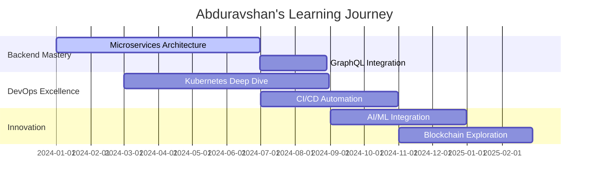

<div align="center">
  
# 💫 Salom, Men **Abduravshan**! 


<p align="center">
   
  
</p>

---

</div>

## 🎯 Men Haqimda

```python
class PythonDeveloper:
    def __init__(self):
        self.name = "Abduravshan"
        self.role = "Backend Developer"
        self.location = "Tashkent, Uzbekistan 🇺🇿"
        self.languages = ["Python", "JavaScript", "SQL"]
        self.passion = "Building scalable backend systems"
    
    def get_current_focus(self):
        return [
            "🔥 Microservices Architecture",
            "⚡ High Performance APIs", 
            "🛡️ Security Best Practices",
            "📊 Database Optimization"
        ]
    
    def daily_routine(self):
        return "☕ Code → 🧪 Test → 🚀 Deploy → 🔄 Repeat"

developer = PythonDeveloper()
```

<div align="center">

## 🛠️ **Texnologiyalar Arsenali**


## 🛠 Stack & Tools

### **Languages**


### **Frameworks & Libraries**


### **Databases**


### **DevOps & Tools**


---


## 📊 **GitHub Analytics**


## 🏆 **GitHub Trophies**


</div>

## 🚀 **Featured Projects**

<table>
<tr>
<td width="50%">

### 🛒 **E-commerce Backend API**


**Xususiyatlari:**
- 🔐 JWT Authentication
- 💳 Payment Gateway Integration  
- 📱 RESTful API Design
- ⚡ Caching with Redis
- 🧪 100% Test Coverage

[📂 **View Project**](https://github.com/abduravshan/ecommerce-api)

</td>
<td width="50%">

### ⚡ **Real-time Chat System**


**Xususiyatlari:**
- 🚀 WebSocket Connections
- 📊 Real-time Analytics
- 🔄 Auto Scaling
- 🛡️ Rate Limiting
- 📈 Message Queue

[📂 **View Project**](https://github.com/abduravshan/realtime-chat)

</td>
</tr>
<tr>
<td width="50%">

### 📋 **Task Management API**


**Xususiyatlari:**
- 🔄 Background Tasks
- 📧 Email Notifications
- 👥 Team Collaboration
- 📊 Progress Tracking
- 🔍 Advanced Filtering

[📂 **View Project**](https://github.com/abduravshan/task-manager)

</td>
<td width="50%">

### 🏦 **Banking System API**


**Xususiyatlari:**
- 🔒 Bank-grade Security
- 💰 Transaction Processing
- 📱 Mobile API Support
- 🧾 Financial Reports
- 🔐 2FA Integration

[📂 **View Project**](https://github.com/abduravshan/banking-api)

</td>
</tr>
</table>

<div align="center">

## 🎯 **2024 Roadmap**



</div>

## 📈 **Current Learning Focus**

<details>
<summary>🔥 <b>Click to see my learning goals!</b></summary>

### 🎯 **Technical Goals**
- [ ] **Microservices** - Service mesh implementation
- [ ] **Kubernetes** - Container orchestration mastery  
- [ ] **GraphQL** - Modern API development
- [ ] **Event-Driven Architecture** - Async messaging
- [ ] **Machine Learning** - AI-powered backends

### 📚 **Books I'm Reading**
- 📖 "Building Microservices" by Sam Newman
- 📖 "Designing Data-Intensive Applications" by Martin Kleppmann
- 📖 "Clean Architecture" by Robert C. Martin

</details>

<div align="center">

## 🌟 **Fun Facts About Me**

<table>
<tr>
<td align="center">☕</td>
<td><b>Daily Fuel:</b> 5+ cups of tea while coding</td>
</tr>
<tr>
<td align="center">🎮</td>
<td><b>Hobby:</b> Strategy games & chess puzzles</td>
</tr>
<tr>
<td align="center">🏃‍♂️</td>
<td><b>Lifestyle:</b> Early morning runner</td>
</tr>
<tr>
<td align="center">📚</td>
<td><b>Learning:</b> Always exploring new tech trends</td>
</tr>
<tr>
<td align="center">🎯</td>
<td><b>Philosophy:</b> "Code is poetry, architecture is art"</td>
</tr>
</table>

## 🤝 **Let's Connect & Collaborate!**

<a href="mailto:your.email@gmail.com">
  
</a>
<a href="https://linkedin.com/in/abduravshan">
  
</a>
<a href="https://t.me/abduravshan">
  
</a>
<a href="https://your-portfolio.com">
  
</a>

---


**💡 "Har bir muammo - yangi imkoniyat, har bir kod qatori - kelajakka qadam!"**

⭐ **Agar loyihalarim yoqsa, star bosishni unutmang!**

</div>
